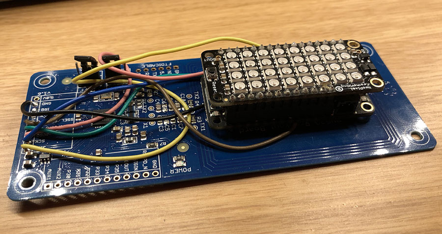
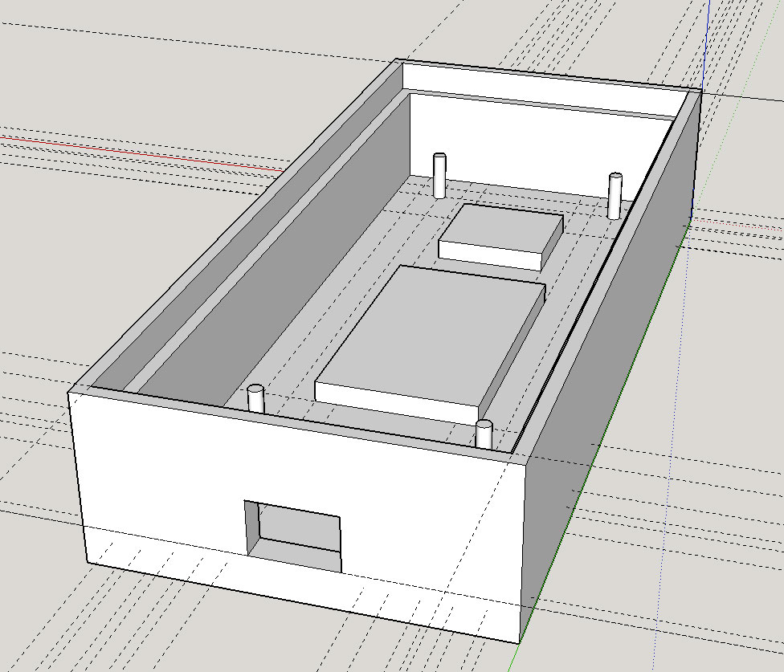

# Limetree

Limetree is a shitty Arduino-style project / Bluetooth bridge that allows people to scan an RFID badge and have the UID of the badge transmitted over Bluetooth to an iOS device.

Limetree is using these components:

[Adafruit Feather nRF52 Bluefruit LE - nRF52832](https://www.adafruit.com/product/3406)
Small sweet BLE board with everything on one chip which makes it less of a hassle not having to use AT commands etc.

[Adafruit PN532 NFC/RFID controller breakout board](https://www.adafruit.com/product/364)
I used the V1.6 version configured in SPI mode.

[NeoPixel FeatherWing - 4x8 RGB LED](https://www.adafruit.com/product/2945)
Slapped this on the Featherboard for some visual feedback of badge scan.

Connections between the boards is as following:

| PN532 |    | nRF52     |
|-------|----|-----------|
| 3.3V  | -> | 3.3V      |
| SCK   | -> | SCK (12)  |
| MISO  | -> | MISO (13) |
| MOSI  | -> | MOSI (14) |
| SSEL  | -> | PIN 16    |
| GND   | -> | GND       |

# BONUS!

I'm adding the Sketchup Model and .dae file for a 3D printable case for this device on which you can slap a frosted piece of plexi on top (fits without screws) and have a nice box for this project.

